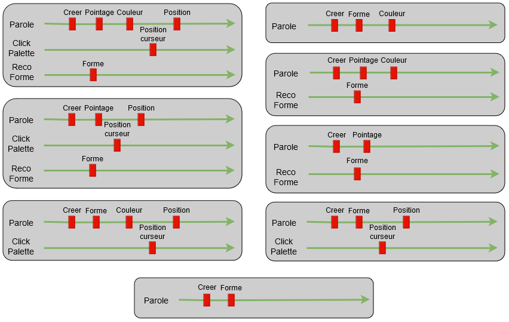
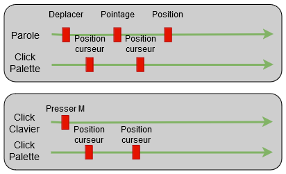
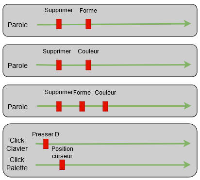
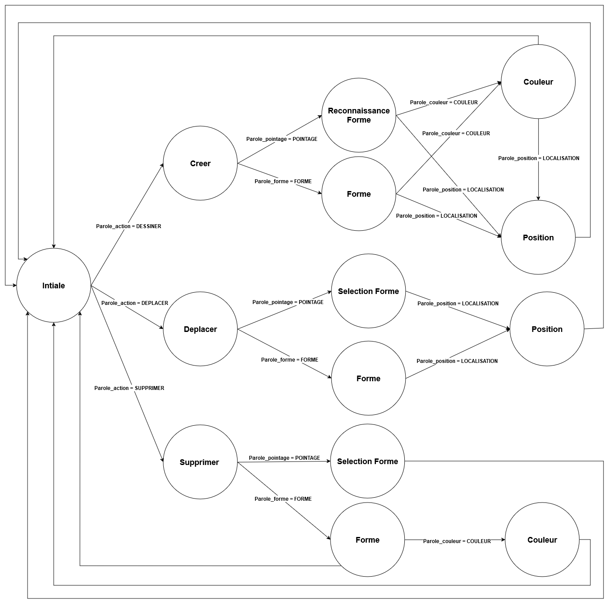

# Moteur multimodal (Processing)

Projet réalisé par **Bastien LALANNE** et **Marc GUEDON** dans le câdre de la 3ème année d'école d'ingénieur en Systèmes Robotiques et Intéractifs à l'UPSSITECH. \
Voici une [vidéo de démonstration](https://youtu.be/XwgSOGQDY5A).

## Chronogrammes des actions réalisables

### Ensemble des chronogrammes pour l'action Dessiner


### Ensemble des chronogrammes pour l'action Déplacer


### Ensemble des chronogrammes pour l'action Supprimer


## Graphe d'états



## Grammaire

DESSINER = {dessiner, créer, tracer} \
SUPPRIMER = {supprimer, effacer} \
DEPLACER = {déplacer,  bouger} \
QUITTER = {quitter, sortir, arrêter} \
ACTION = DESSINER | SUPPRIMER | DEPLACER

POINTAGE = {cette forme, ça, ceci} \
LOCALISATION = {là, ici, à cete endroit}

FORME = losange | rectangle | cercle | triangle \
COULEUR = rouge | orange | jaune | vert | bleu | violet | noir

## Installation

Pour faire fonctionner notre moteur multimodal, il suffit d'installer [Java Runtime Environement 17](https://www.oracle.com/java/technologies/javase/jdk17-archive-downloads.html) si ce n'est pas déjà le cas. \
**ATTENTION**: le moteur multimodal n'a été testé que sous Windows.

## Utilisation

Pour lancer notre moteur multimodal, il exécuter la commande suivante dans le dossier courant. Les applications Palette, SRA5 et OneDollarIvy seront alors exécutées. Il est également possible d'exécuter le Visionneur en ajoutant l'option `--visionneur` ou son diminutif `-v`.
```console
.\launcher.bat
.\launcher.bat -v
.\launcher.bat --visionneur
```

Pour relancer l'ensemble des applications, il faut préalablement s'assurer de les avoir fermé une par une.

## Actions réalisables
### Ajout d'une forme

- Appuyer respectivement sur la touche "c", "r", "t" ou "l" pour ajouter un cercle, un rectangle, un triangle ou un losange gris où se trouve le pointeur. Si le pointeur se trouve en dehors de la fenêtre, la forme s'affiche au dernier endroit où était le pointeur dans la fenêtre.
- Prononcer "Dessiner + FORME + COULEUR" pour ajouter un objet ayant la forme et la couleur prononcée.
- Prononcer "Dessiner + FORME" pour ajouter un objet ayant la forme prononcée.
- Prononcer "Dessiner + FORME + COULEUR + LOCALISATION" pour ajouter un objet ayant la forme et la couleur prononcée à l'emplacement du pointeur.
- Prononcer "Dessiner + FORME + LOCALISATION" pour ajouter un objet ayant la forme prononcée à l'emplacement du pointeur.
- Dessiner la forme souhaitée sur la fenêtre de OneDollarIvy, puis prononcer "Dessiner cette forme [+ COULEUR] + LOCALISATION", pour ajouter un objet ayant la forme prononcée où se trouve le pointer. Au delà de 5s, la forme dessinée ne sera plus prise en compte, il faudra alors recommencer. De même, si 5s après avoir dessiné une forme, rien n'a été prononcé, l'action est annulée.

### Déplacement d'une forme

- Appuyer sur "m" et cliquer sur l'objet voulu, puis cliquer à l'endroit où déplacer la forme présélectionnée. Si 5s après avoir appuyé sur "m", aucun objet est sélectionné, l'action est annulée. De même pour choisir le nouvel emplacement de l'objet.
- prononcer "Déplacer + POINTAGE", puis cliquer sur l'objet à déplacer, puis cliquer à l'endroit où déplacer la forme présélectionnée.

### Suppression de formes

- Appuyer sur la touche "d" puis cliquer sur la forme voulue pour supprimer la forme en question.
- Prononcer "Supprimer + FORME + COULEUR" pour supprimer l'ensemble des objets ayant la forme et la couleur prononcées.
- Prononcer "Supprimer + FORME" pour supprimer l'ensemble des objets ayant la forme prononcée.
- Prononcer "Supprimer + COULEUR" pour supprimer l'ensemble des objets ayant la couleur prononcée.
- Prononcer "Supprimer + POINTAGE" puis cliquer sur un objet pour supprimer l'objet en question.

### Quitter l'application

- Prononcer "QUITTER" pour quitter la palette.